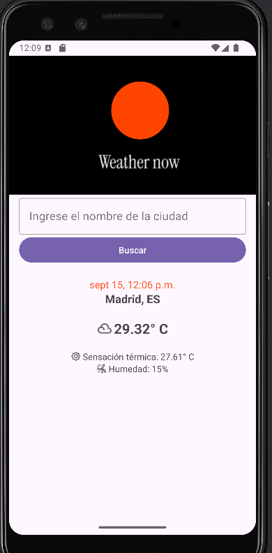
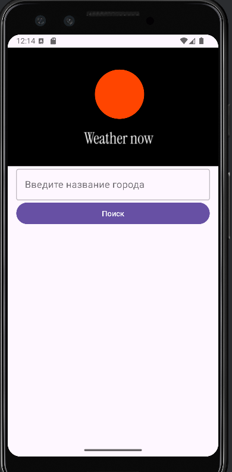

#  WeatherAPP 


<div style="display: flex; justify-content: space-around;">
  
  
  
</div>

## 🌐 [](https://github.com/SamuelRocha91/kotlinWeatherApp/blob/main/README.md) [](https://github.com/SamuelRocha91/kotlinWeatherApp/blob/main/README_es.md) [](https://github.com/SamuelRocha91/kotlinWeatherApp/blob/main/README_en.md) [](https://github.com/SamuelRocha91/kotlinWeatherApp/blob/main/README_ru.md) [](https://github.com/SamuelRocha91/kotlinWeatherApp/blob/main/README_ch.md) [](https://github.com/SamuelRocha91/kotlinWeatherApp/blob/main/README_ar.md)

## Descrição

O **WeatherApp** é uma aplicação Android simples que permite ao usuário buscar informações sobre o clima de qualquer cidade em tempo real, usando a API do **OpenWeather**. Com uma interface amigável, o usuário pode ver a temperatura atual, sensação térmica, umidade e o horário da última atualização do clima.

## Funcionalidades

- Busca de clima em tempo real por cidade.
- Exibe a temperatura atual (em Celsius), sensação térmica, umidade e nome da cidade.
- Interface minimalista e amigável.
- Toast customizado para erros e mensagens.

## Tecnologias Utilizadas

- **Kotlin**: Linguagem principal usada no desenvolvimento do app.
- **Coroutines**: Utilizado para operações assíncronas como requisições à API de clima.
- **Retrofit**: Biblioteca usada para consumo de APIs RESTful.
- **OpenWeather API**: API usada para obter as informações meteorológicas.
- **Material Design**: Componentes do Android Material Design para uma interface visualmente agradável.
- **Toast customizado**: Para exibir mensagens de erro mais chamativas.

## Configuração do Projeto

### Pré-requisitos

- Android Studio 4.1 ou superior.
- Gradle 7.0 ou superior.
- Conta no [OpenWeather API](https://openweathermap.org/api) para obter uma chave de API.

### Instalação

1. Clone o repositório:

   ```bash
   git clone git@github.com:SamuelRocha91/kotlinWeatherApp.git
   ```

2. Abra o projeto no **Android Studio**.

3. Adicione sua chave da API do OpenWeather no arquivo `local.properties`:

   ```
   API_KEY=your_api_key_here
   ```

4. Compile e rode o projeto no seu emulador ou dispositivo Android.

### Estrutura do Código

- **MainActivity.kt**: Principal atividade da aplicação que gerencia a interface e lida com as interações do usuário.
- **OpenWeather.kt**: Interface que define as chamadas à API de clima usando Retrofit.
- **Utilidades**: Funções utilitárias, como a conversão de timestamp Unix para formato legível, podem ser extraídas e colocadas em uma classe de utilidades.
- **Layouts**: Arquivos de layout XML definidos na pasta `res/layout`, que incluem a estrutura da interface do usuário.

### Dependências

- `implementation "org.jetbrains.kotlinx:kotlinx-coroutines-core:1.5.2"`
- `implementation "com.squareup.retrofit2:retrofit:2.9.0"`
- `implementation "com.squareup.retrofit2:converter-gson:2.9.0"`
- `implementation "com.google.android.material:material:1.4.0"`

## Como Usar

1. Abra o app.
2. Insira o nome de uma cidade no campo de busca.
3. Clique no botão "Buscar".
4. Veja as informações sobre o clima, incluindo:
    - Temperatura atual.
    - Sensação térmica.
    - Umidade.
    - Nome da cidade e país.

## Melhorias Futuras

- Adicionar suporte para múltiplas unidades de medida (Celsius, Fahrenheit).
- Implementar previsão do tempo para os próximos dias.
- Adicionar mais ícones para diferentes condições climáticas (nublado, chuvoso, etc.).
- Suporte offline com cache das últimas consultas.

## Outros projetos Kotlin:

- 📜 [Virtual Menu](https://github.com/SamuelRocha91/kotlinVirtualMenu)
- 👤 [Social Login](https://github.com/SamuelRocha91/kotlinLoginSocial)
- 💱 [kotlin Exchange Rate](https://github.com/SamuelRocha91/kotlinExchangeRate)

