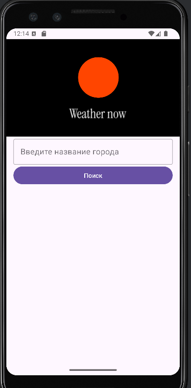

#  WeatherAPP 


<div style="display: flex; justify-content: space-around;">
  
  
  
</div>

## 🌠[](https://github.com/SamuelRocha91/kotlinWeatherApp/blob/main/README.md) [](https://github.com/SamuelRocha91/kotlinWeatherApp/blob/main/README_es.md) [](https://github.com/SamuelRocha91/kotlinWeatherApp/blob/main/README_en.md) [](https://github.com/SamuelRocha91/kotlinWeatherApp/blob/main/README_ru.md) [](https://github.com/SamuelRocha91/kotlinWeatherApp/blob/main/README_ch.md) [](https://github.com/SamuelRocha91/kotlinWeatherApp/blob/main/README_ar.md)

<details>
  <summary><h2>📜 描述</h2></summary>

  **WeatherApp** 是一个简单的 Android 应用程序，允许用户实时搜索任何城市的天气信息，使用 **OpenWeather** API。通过直观的界面，用户可以查看当前温度、体感温度、湿度和最后更新时间。

</details>

<details>
  <summary><h2>🌟 功能</h2></summary>

  - 实时城市天气搜索。
  - 显示当前温度（摄氏度）、体感温度、湿度和城市名称。
  - 极简且用户友好的界面。
  - 个性化的 Toast 消息用于错误和通知。

</details>

<details>
  <summary><h2>🛠️ 使用的技术</h2></summary>

  - **Kotlin**: 应用程序开发的主要语言。
  - **Coroutines**: 用于异步操作，例如天气 API 请求。
  - **Retrofit**: 用于与 RESTful API 交互的库。
  - **OpenWeather API**: 用于获取天气信息的 API。
  - **Material Design**: Android 的 Material 设计组件，提供视觉上愉悦的界面。
  - **个性化 Toast**: 用于显示更显眼的错误消息。

</details>

<details>
  <summary><h2>⚙️ 项目设置</h2></summary>

  <details>
    <summary><h3>先决条件</h3></summary>

    - Android Studio 4.1 或更高版本。
    - Gradle 7.0 或更高版本。
    - 在 [OpenWeather API](https://openweathermap.org/api) 上注册账户以获取 API 密钥。

  </details>

  <details>
    <summary><h3>安装</h3></summary>

    1. 克隆仓库：
       ```bash
       git clone git@github.com:SamuelRocha91/kotlinWeatherApp.git
       ```

    2. 在 **Android Studio** 中打开项目。

    3. 将你的 OpenWeather API 密钥添加到 `local.properties` 文件中：
       ```
       API_KEY=your_api_key_here
       ```

    4. 构建并在模拟器或 Android 设备上运行项目。

  </details>

</details>

<details>
  <summary><h2>📂 代码结构</h2></summary>

  - **MainActivity.kt**: 应用程序的主活动，管理用户界面并处理用户交互。
  - **OpenWeather.kt**: 定义与天气 API 的调用接口，使用 Retrofit。
  - **工具**: 实用功能，例如将 Unix 时间戳转换为可读格式，可以提取并放入工具类中。
  - **布局**: 在 `res/layout` 文件夹中定义的 XML 布局文件，包括用户界面的结构。

</details>

<details>
  <summary><h2>📦 依赖项</h2></summary>

  - `implementation "org.jetbrains.kotlinx:kotlinx-coroutines-core:1.5.2"`
  - `implementation "com.squareup.retrofit2:retrofit:2.9.0"`
  - `implementation "com.squareup.retrofit2:converter-gson:2.9.0"`
  - `implementation "com.google.android.material:material:1.4.0"`

</details>

<details>
  <summary><h2>🧑‍🤝‍🧑 使用方法</h2></summary>

  1. 打开应用程序。
  2. 在搜索框中输入城市名称。
  3. 点击“搜索”按钮。
  4. 查看天气信息，包括：
      - 当前温度。
      - 体感温度。
      - 湿度。
      - 城市和国家名称。

</details>

<details>
  <summary><h2>📁 其他 Kotlin 项目：</h2></summary>

  - 📜 [虚拟菜单](https://github.com/SamuelRocha91/kotlinVirtualMenu/blob/main/README_ch.md)
  - 👤 [社交登录](https://github.com/SamuelRocha91/kotlinLoginSocial/blob/main/README_ch.md)
  - 💱 [汇率](https://github.com/SamuelRocha91/kotlinExchangeRate/blob/main/README_ch.md)

</details>