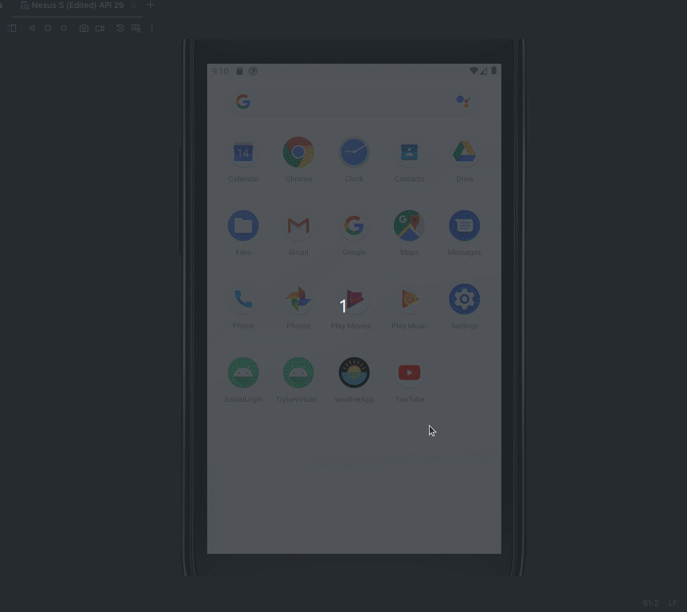

# WeatherApp



## Description

The **WeatherApp** is a simple Android application that allows users to search for real-time weather information for any city using the **OpenWeather API**. With a user-friendly interface, users can view the current temperature, feels-like temperature, humidity, and the time of the last weather update.

## Features

- Real-time weather search by city.
- Displays current temperature (in Celsius), feels-like temperature, humidity, and city name.
- Minimalistic and user-friendly interface.
- Custom toast messages for errors and notifications.

## Technologies Used

- **Kotlin**: Main language used for app development.
- **Coroutines**: Used for asynchronous operations like weather API requests.
- **Retrofit**: Library used for consuming RESTful APIs.
- **OpenWeather API**: API used to fetch weather information.
- **Material Design**: Android Material Design components for a visually appealing interface.
- **Custom Toast**: Used for displaying more engaging error messages.

## Project Setup

### Prerequisites

- Android Studio 4.1 or later.
- Gradle 7.0 or later.
- An account with [OpenWeather API](https://openweathermap.org/api) to obtain an API key.

### Installation

1. Clone the repository:

   ```bash
   git clone git@github.com:SamuelRocha91/kotlinWeatherApp.git
   ```

2. Open the project in **Android Studio**.

3. Add your OpenWeather API key to the `local.properties` file:

   ```
   API_KEY=your_api_key_here
   ```

4. Build and run the project on your emulator or Android device.

### Code Structure

- **MainActivity.kt**: The main activity of the application that manages the interface and handles user interactions.
- **OpenWeather.kt**: Interface that defines the API calls to fetch weather data using Retrofit.
- **Utilities**: Utility functions, such as converting Unix timestamps to a readable format, can be extracted into a utilities class.
- **Layouts**: XML layout files are defined in the `res/layout` folder, which include the structure of the user interface.

### Dependencies

- `implementation "org.jetbrains.kotlinx:kotlinx-coroutines-core:1.5.2"`
- `implementation "com.squareup.retrofit2:retrofit:2.9.0"`
- `implementation "com.squareup.retrofit2:converter-gson:2.9.0"`
- `implementation "com.google.android.material:material:1.4.0"`

## How to Use

1. Open the app.
2. Enter the name of a city in the search field.
3. Click the "Search" button.
4. View weather information including:
    - Current temperature.
    - Feels-like temperature.
    - Humidity.
    - City and country name.

## Future Improvements

- Add support for multiple measurement units (Celsius, Fahrenheit).
- Implement weather forecasts for upcoming days.
- Add more icons for different weather conditions (cloudy, rainy, etc.).
- Offline support with cached results for the latest searches.

---
