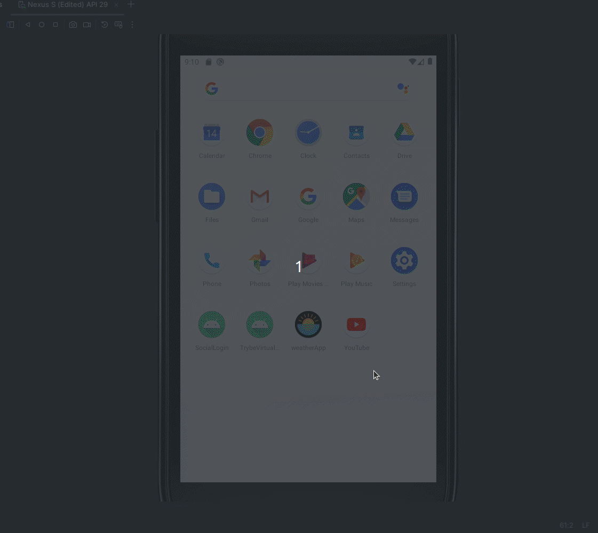

# WeatherApp



## Descripción

**WeatherApp** es una aplicación simple de Android que permite al usuario buscar información meteorológica en tiempo real para cualquier ciudad, utilizando la API de **OpenWeather**. Con una interfaz amigable, el usuario puede ver la temperatura actual, sensación térmica, humedad y la hora de la última actualización del clima.

## Funcionalidades

- Búsqueda de clima en tiempo real por ciudad.
- Muestra la temperatura actual (en Celsius), sensación térmica, humedad y el nombre de la ciudad.
- Interfaz minimalista y fácil de usar.
- Mensajes de Toast personalizados para errores y notificaciones.

## Tecnologías Utilizadas

- **Kotlin**: Lenguaje principal usado en el desarrollo de la aplicación.
- **Coroutines**: Utilizado para operaciones asíncronas como las solicitudes a la API de clima.
- **Retrofit**: Librería utilizada para consumir APIs RESTful.
- **OpenWeather API**: API utilizada para obtener la información meteorológica.
- **Material Design**: Componentes de Android Material Design para una interfaz visualmente agradable.
- **Toast Personalizado**: Para mostrar mensajes de error más llamativos.

## Configuración del Proyecto

### Requisitos Previos

- Android Studio 4.1 o superior.
- Gradle 7.0 o superior.
- Una cuenta en [OpenWeather API](https://openweathermap.org/api) para obtener una clave de API.

### Instalación

1. Clona el repositorio:

   ```bash
   git clone git@github.com:SamuelRocha91/kotlinWeatherApp.git
   ```

2. Abre el proyecto en **Android Studio**.

3. Añade tu clave de API de OpenWeather en el archivo `local.properties`:

   ```
   API_KEY=tu_clave_de_api_aquí
   ```

4. Compila y ejecuta el proyecto en tu emulador o dispositivo Android.

### Estructura del Código

- **MainActivity.kt**: Actividad principal de la aplicación que gestiona la interfaz y las interacciones del usuario.
- **OpenWeather.kt**: Interfaz que define las llamadas a la API de clima utilizando Retrofit.
- **Utilidades**: Funciones útiles como la conversión de timestamp Unix a un formato legible pueden colocarse en una clase de utilidades.
- **Layouts**: Archivos de diseño XML definidos en la carpeta `res/layout`, que incluyen la estructura de la interfaz de usuario.

### Dependencias

- `implementation "org.jetbrains.kotlinx:kotlinx-coroutines-core:1.5.2"`
- `implementation "com.squareup.retrofit2:retrofit:2.9.0"`
- `implementation "com.squareup.retrofit2:converter-gson:2.9.0"`
- `implementation "com.google.android.material:material:1.4.0"`

## Cómo Usar

1. Abre la aplicación.
2. Ingresa el nombre de una ciudad en el campo de búsqueda.
3. Haz clic en el botón "Buscar".
4. Verás la información del clima, que incluye:
    - Temperatura actual.
    - Sensación térmica.
    - Humedad.
    - Nombre de la ciudad y del país.

## Mejoras Futuras

- Añadir soporte para múltiples unidades de medida (Celsius, Fahrenheit).
- Implementar pronóstico del tiempo para los próximos días.
- Agregar más iconos para diferentes condiciones climáticas (nublado, lluvioso, etc.).
- Soporte sin conexión con almacenamiento en caché de las últimas consultas.

---
